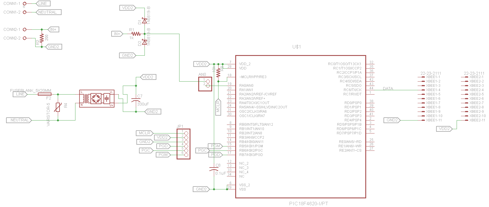

# Connected Factory
## A Remote Monitoring and Data Logging System

This project was realized in **2015** for the end of my college studies 
and as part of the **CRÉE TA VILLE** (CREATE YOUR CITY) contest, which 
challenged the participants to carry out innovative projects aimed at 
improving the city of today and creating the city of tomorrow.

My proposed project, the **Connected Factory**, allows the user to 
monitor each of his connected devices simultaneously and download the 
reading history (logged data) in csv format for each device. From the 
web page, the devices can also be configured (e.g., delete the data 
history, change device name, change device range, change device output 
type).

### Data Capture Module

The data capture module reads the input data every five seconds and 
transmits if wirelessly to the data processing module.

This module is composed of a power supply circuit, a conversion circuit 
(for 4-20 mA input readings), a protection circuit and a microcontroller 
(PIC18F4620) connected to a [Digi XBee RF module][digi-xbee] with a 
[regulator][xbee-explorer]. With the help of its internal ADC, the 
microcontroller reads the input voltage every five seconds using a timer 
interrupt and communicates the digital value to the XBee module with his 
built-in UART module, adding the device ID to the message transmitted 
(format: `<ID-Data>`). The XBee module relays the message wirelessly to 
the data processing module.

For every equipment the user wants to monitor, simply add a data capture 
module and connect it to the equipment's output. Once connected and 
powered, the module will start transmitting the data immediately to the 
master XBee module (data processing module), and the new equipment will 
automatically appear on the monitoring web page.

### Data Processing Module

On the data processing side, the master XBee module continuously 
receives the data from the data capture modules and transmits it to the 
microcontroller ([Arduino Uno][arduino]). The Arduino Uno was used with 
an [Ethernet shield][ethernet-shield] to communicate the data to the 
server, which helped rapidly prototype this project for the timeframe 
imposed.

Whenever the microcontroller receives a packet on its serial port, the 
packet is read and its content is stored in a buffer until the packet is 
received completely. With the help of the delimiters (`<`, `-`, `>`), 
the device ID and data are parsed and transmitted to the server via 
Ethernet with the help of GET requests.

### Server Side + Remote Access

Although the server can be run on pretty much any compatible machine 
with MySQL, a [BeagleBone Black][bbb] was used and configured to run 
the server-side scripts. The embedded computer was running under the 
Debian Linux distribution, and automatically assigned itself a static IP 
on your private network when powered on.

On the front-end, the web page is developped in HTML5 with Bootstrap for 
a responsive monitoring system. Different PHP5 scripts are executed on 
the back-end side whenever the user accesses the web page, tries to 
modify a device's configuration, or downloads/deletes the logged data 
history.

On the main page, the different devices connected are displayed along 
with their current readings, which are updated every 5 seconds. Each 
device connected is automatically displayed when accessing the page, so 
a simple page refresh suffices for a newly connected device to appear. 
Because all of the reading data is automatically stored in the server's 
MySQL database, the data history for each device can easily be 
downloaded in csv format.

*Disclaimer: prior to this project (2015), I had no web programming 
experience (and basically had just started programming in C). Throughout 
this project, I improved my programming abilities and learned HTML, PHP 
& SQL.* 

<!-- Links -->
[digi-xbee]:https://www.digi.com/products/embedded-systems/rf-modules/2-4-ghz-modules/xbee-digimesh-2-4
[xbee-explorer]:https://www.sparkfun.com/products/11373
[arduino]:https://store.arduino.cc/usa/arduino-uno-rev3
[ethernet-shield]: https://www.arduino.cc/en/Reference/Ethernet
[bbb]:https://beagleboard.org/black
