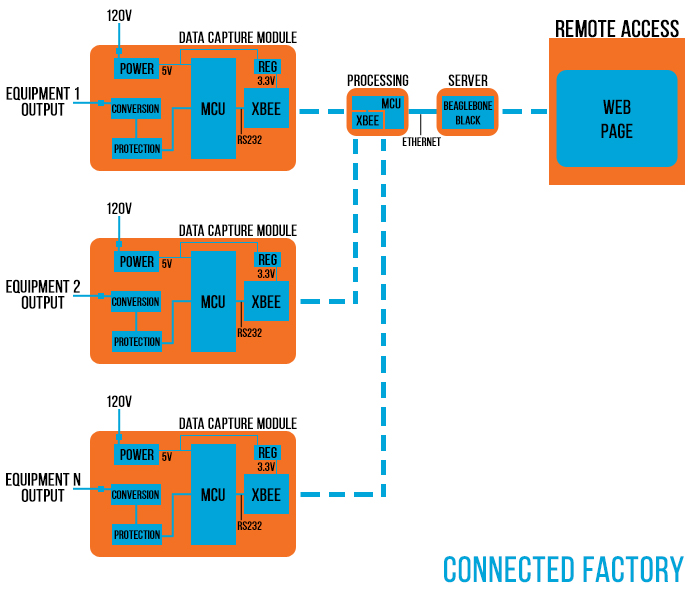

# Connected Factory
## A Remote Monitoring and Data Logging System

This project was realized in 2015 for the end of my college studies 
and as part of the "CRÉE TA VILLE" (CREATE 
YOUR CITY) contest, which challenged the participants to carry out 
innovative projects aimed at improving the city of today and creating 
the city of tomorrow.

My proposed project, the `Connected Factory`, allows the user to monitor 
each of his connected devices simultaneously and download the reading 
history (logged data) in csv format for each device. From the web page, 
the devices can also be configured (e.g., delete the data history, 
change device name, change device range, change device output type).

### Data Capture Module

### Data Processing Module

### Server Side + Remote Access

*Disclaimer: prior to this project (2015), I had no web programming 
experience. This was a great opportunity for me to develop 
my programming skills, and learn HTML, PHP and MySQL* 
